# Active Directory Home Lab  

## Overview  
This project is a hands-on **Active Directory (AD) home lab** built using **VirtualBox, Windows Server 2022, and Windows 10**. The lab simulates a small corporate environment where a domain controller manages authentication, DHCP, DNS, NAT, and Windows clients.  

The goal of this project was to strengthen my knowledge of:  
- **Active Directory Domain Services (AD DS)**  
- **Networking services (DHCP, DNS, NAT)**  
- **Domain user and client management**  
- **Automation with PowerShell**  

---

## Lab Diagram  
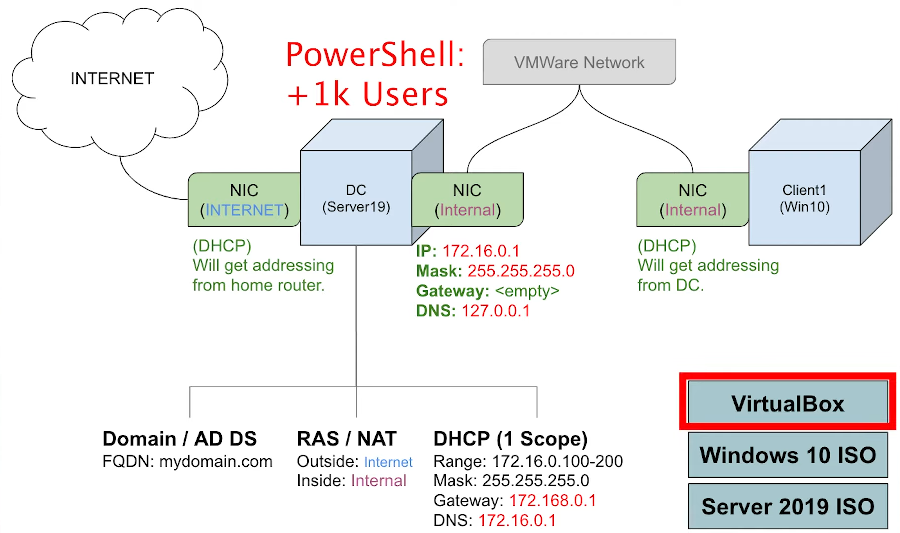  

---

## Lab Setup  
- **Domain Controller (DC)**: Windows Server 2022  
- **Client Machine**: Windows 10 Pro  
- **Virtualization**: VirtualBox  
- **Domain**: `mydomain.com`  

---

## Steps  

### 1. Domain Controller Setup (Windows Server 2022)  
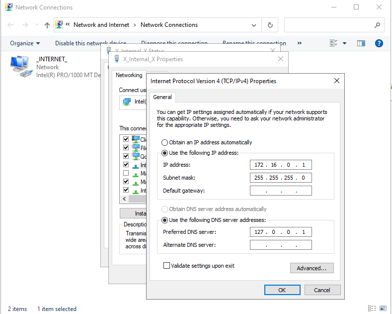  
- Installed Windows Server 2022 VM in VirtualBox and named it **DC**.  
- Configured networking with two adapters:  
  - **INTERNET** (bridged/external network).  
  - **X_Internal_X** (internal VirtualBox network).  
- Assigned a static IP (`172.16.0.1`) for internal communication.  
- Installed **Active Directory Domain Services** and promoted the server to a **Domain Controller** for the root domain:  

### 2. Administrative Setup  
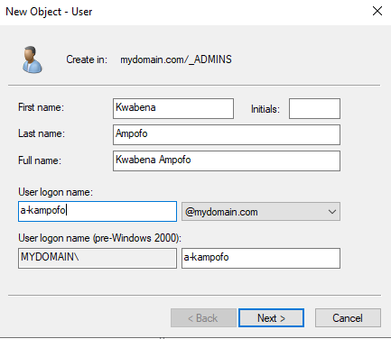  
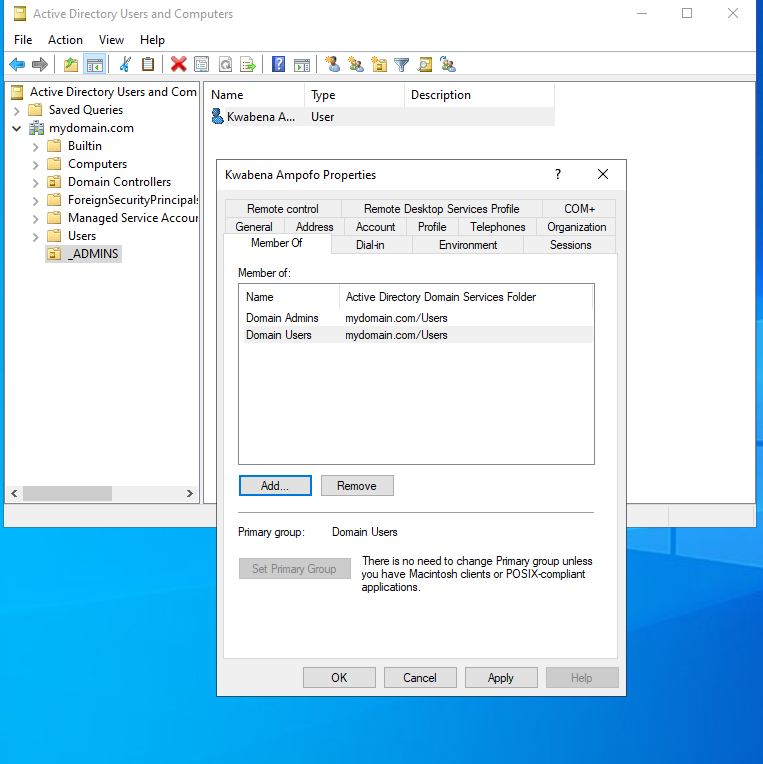  
- Created an **_ADMINS** organizational unit (OU).  
- Added a new **domain admin account** for management.  

### 3. Network Services  
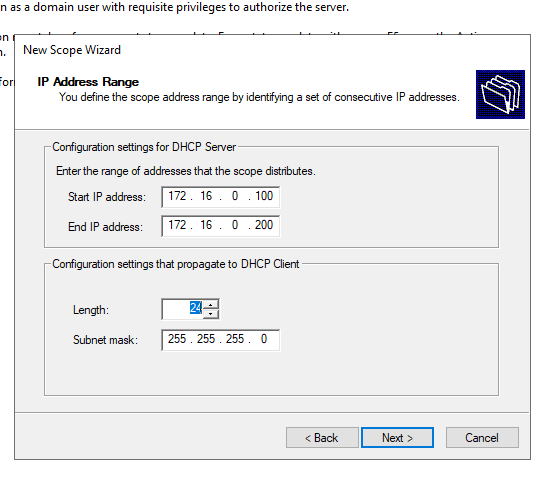  
- Installed **Routing and Remote Access (NAT)** to enable internet connectivity for internal clients.  
- Installed and configured **DHCP Server**:  
- Scope: `172.16.0.100 – 172.16.0.200`  
- Authorized DC as DHCP server.  

### 4. Bulk User Creation with PowerShell  
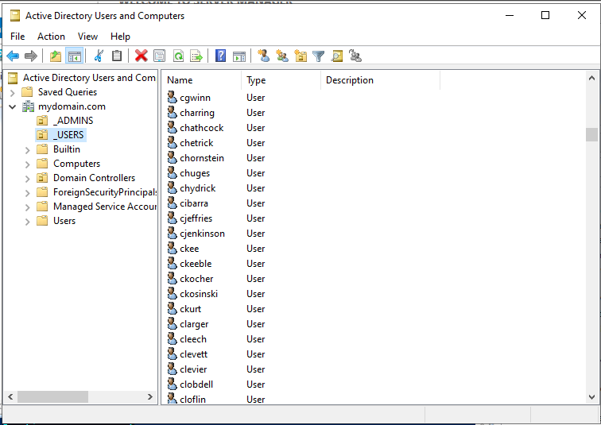  
- Downloaded Josh Madakor’s AD PowerShell script.  
- Configured script to create **1,000 domain users** with random names.  
- Executed script successfully, populating the **_EMPLOYEES OU**.  

### 5. Client Setup (Windows 10 Pro)  
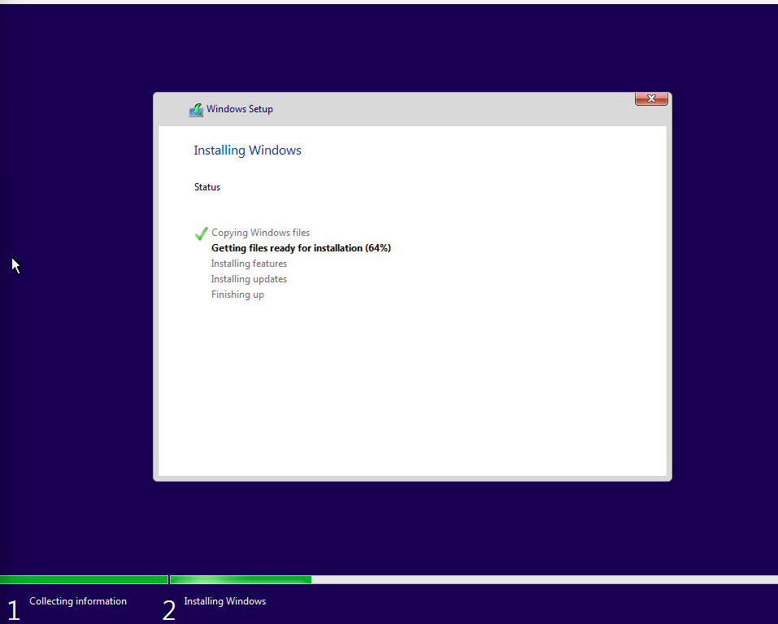  
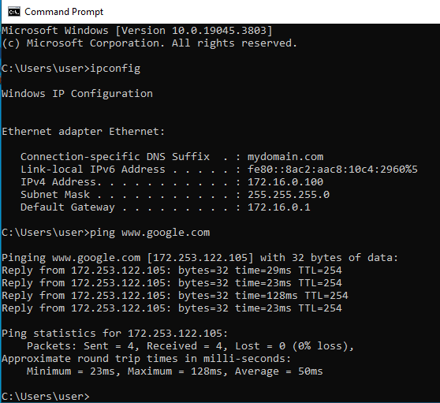  
- Created a Windows 10 Pro VM named **CLIENT1**.  
- Configured networking to use **internal adapter**.  
- Joined the domain (`mydomain.com`) using domain admin credentials.
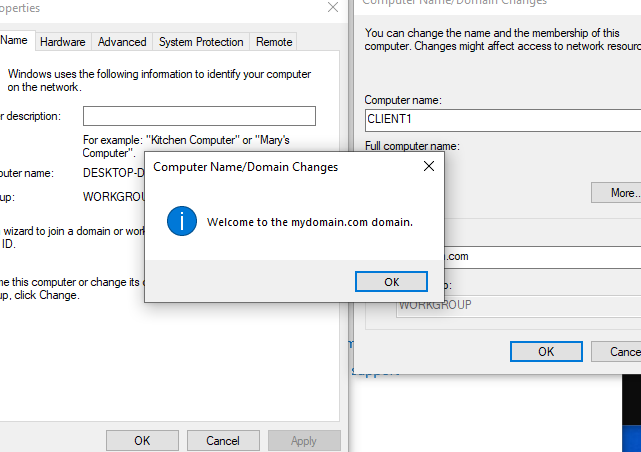
- Verified DHCP lease assignment and domain join success.  
- Logged into CLIENT1 using one of the newly created AD accounts.  
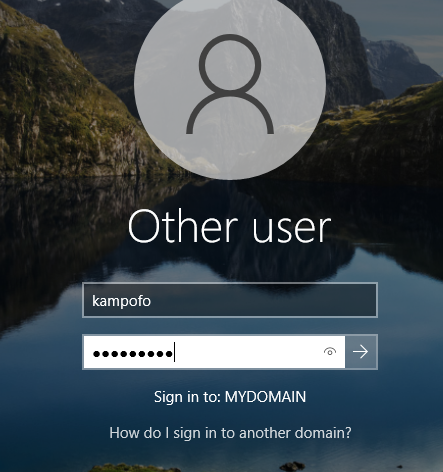
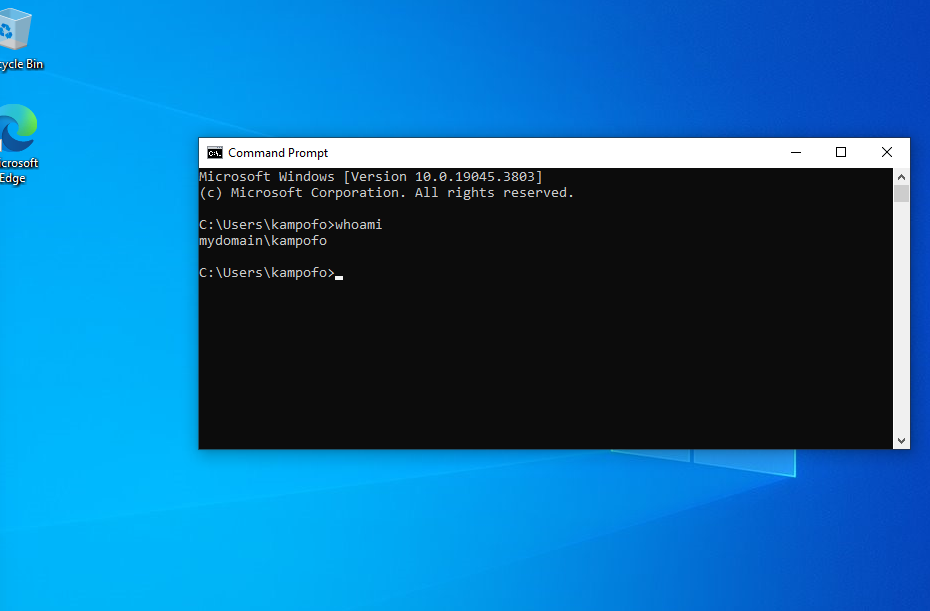

---

## Key Configurations  
- Installed **AD DS** and promoted server to Domain Controller.  
- Created **Organizational Units (OUs)** for admins and employees.  
- Configured **DHCP** (scope: `172.16.0.100 – 172.16.0.200`) and **NAT** for network connectivity.  
- Automated **bulk user creation** with PowerShell (1,000 accounts).  
- Joined a **Windows 10 client** to the domain and validated login with AD credentials.  

---

## Key Takeaways  
- Built and configured an **Active Directory domain** from scratch.  
- Learned how **DNS, DHCP, and NAT** integrate into a domain environment.  
- Automated large-scale **user account creation** with PowerShell.  
- Successfully **joined and authenticated a client machine** within the domain.
